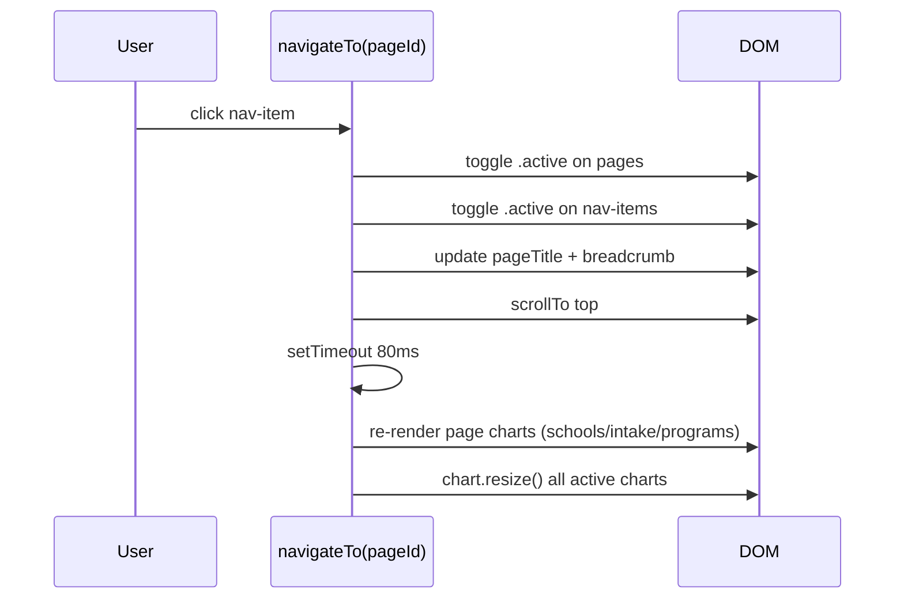

# Design Document: MRU Admissions Dashboard

## Overview

The MRU Admissions Dashboard is a 6-page single-page application (SPA) that visualises Manav Rachna University admissions data across three academic sessions (2024–25, 2025–26, 2026–27). It is built with vanilla HTML + CSS + JavaScript, uses Chart.js v4.4.0 with the chartjs-plugin-datalabels extension for all charts, and loads data from a static `dashboard_data.json` file. A planned FastAPI + SQLite backend on Hugging Face Space will eventually replace the static JSON with a live sync pipeline from Google Sheets.

The dashboard provides admissions officers and university leadership with at-a-glance KPIs, trend analysis, program-level drill-downs, school comparisons, and intake vs fill-rate analytics — all rendered inside a dark glassmorphism UI with Inter typography and a fixed sidebar navigation.

---

## Architecture

```mermaid
graph TD
    A[Browser] -->|fetch dashboard_data.json| B[Static JSON]
    A --> C[index.html SPA]
    C --> D[style.css — Design System]
    C --> E[app.js — All Logic]
    E --> F[Chart.js v4.4.0]
    E --> G[chartjs-plugin-datalabels]
    E --> H[Navigation Controller]
    E --> I[Page Renderers x6]
    I --> I1[renderOverviewPage]
    I --> I2[renderInsightsPage]
    I --> I3[renderTrendsPage]
    I --> I4[renderProgramsPage]
    I --> I5[renderSchoolsPage]
    I --> I6[renderIntakePage]
    B -->|time_series| I1
    B -->|faculty_breakdown| I4
    B -->|school_date_wise| I5
    B -->|program_categories| I1

    subgraph Planned Backend
        J[FastAPI on HF Space] -->|/sync| K[Google Sheets]
        J -->|SQLite| L[/data endpoint]
        L -->|replaces static JSON| B
    end
```

---

## Sequence Diagrams

### App Boot & Data Load

```mermaid
sequenceDiagram
    participant Browser
    participant boot()
    participant fetch
    participant init()

    Browser->>boot(): DOMContentLoaded
    boot()->>Browser: inject .spinner-wrap overlay
    boot()->>fetch: GET dashboard_data.json
    fetch-->>boot(): DATA object
    boot()->>Browser: fade out spinner
    boot()->>init(): DATA ready
    init()->>init(): wire nav click handlers
    init()->>init(): populate date selectors
    init()->>init(): attach control change listeners
    init()->>init(): renderOverviewPage()
    init()->>init(): renderInsightsPage()
    init()->>init(): renderTrendsPage()
    init()->>init(): renderProgramsPage()
    init()->>init(): renderSchoolsPage()
    init()->>init(): renderIntakePage()
```

### Page Navigation



---

## Components and Interfaces

### Component: Navigation Controller

**Purpose**: Manages page visibility, active states, and chart resize on tab switch.

**Interface**:
```javascript
function navigateTo(pageId: string): void
// pageId ∈ ['overview','insights','trends','programs','schools','intake']
```

**Responsibilities**:
- Toggle `.active` class on `.page` divs and `.nav-item` anchors
- Update topbar title and breadcrumb text
- Re-render data-dependent pages (programs, schools, intake) after 80ms delay
- Force `chart.resize()` on all registered chart instances

---

### Component: Chart Registry

**Purpose**: Tracks all Chart.js instances to enable destroy-before-rebuild and resize.

**Interface**:
```javascript
const activeCharts: Record<string, Chart> = {}

function rebuildChart(id: string, config: ChartConfiguration): Chart | null
// Destroys existing chart at `id`, creates new one, registers it
```

**Responsibilities**:
- Prevent canvas reuse errors by always destroying before creating
- Provide a single registry for `chart.resize()` calls

---

### Component: Page Renderers

Six top-level render functions, each called once on boot and re-called on navigation:

```javascript
function renderOverviewPage(): void   // KPIs + 5 charts
function renderInsightsPage(): void   // 4 text insight sections
function renderTrendsPage(): void     // 5 charts
function renderProgramsPage(): void   // reads controls, 5 charts
function renderSchoolsPage(): void    // reads date control, 5 charts
function renderIntakePage(): void     // 3 stat cards + 5 charts
```

---

### Component: Design System Helpers

```javascript
const COLORS: Record<string, string>
// { '2024': '#00e5ff', '2025': '#b57bee', '2026': '#4f8dfd',
//   green, rose, amber, indigo }

const SCHOOL_PALETTE: string[]
// 10-color array for multi-series charts

function hexA(hex: string, alpha: number): string
// Returns rgba() string from hex + alpha

function lineDS(label, data, color, fill?): ChartDataset
// Builds a standard line dataset with tension, point radius, fill

function lineOpts(overrides?): ChartOptions
// Returns standard line chart options (grid, tooltip, no datalabels)

function tooltipConfig(): TooltipOptions
// Dark background, white text, Inter font tooltip config
```

---

## Data Models

### time_series

```javascript
type TimeSeriesPoint = {
  date: string        // e.g. "31 Oct"
  '2024': number      // cumulative admissions
  '2025': number
  '2026': number
}
// Array ordered Jan → Oct, 21 data points
```

### faculty_breakdown

```javascript
type ProgramRecord = {
  program: string     // full program name
  school: string      // e.g. "MRSoE"
  '2024': { intake: number, admissions: number, withdrawals: number }
  '2025': { intake: number, admissions: number, withdrawals: number }
  '2026': { intake: number, admissions: number, withdrawals: number }
}
// Keyed by date string, e.g. "31 Oct"
// Includes "Total {School}" summary rows — filter these for per-program charts
type FacultyBreakdown = Record<string, ProgramRecord[]>
```

### school_date_wise

```javascript
type SchoolStats = { intake: number, admissions: number, withdrawals: number }
type SchoolDateWise = Record<string, Record<string, Record<string, SchoolStats>>>
// school_date_wise["31 Oct"]["MRSoE"]["2024"] → SchoolStats
```

### program_categories

```javascript
type CategoryStats = {
  count: number
  intake_2024: number; intake_2025: number; intake_2026: number
  admissions_2024: number; admissions_2025: number; admissions_2026: number
}
type ProgramCategories = Record<string, CategoryStats>
// Keys: "B.Tech CSE", "B.Tech Other", "BCA/BBA/MBA", "M.Tech/M.Sc", "Other"
```

---

## Algorithmic Pseudocode

### KPI Computation

```pascal
ALGORITHM buildKPIs(DATA)
INPUT: DATA — global data object
OUTPUT: DOM mutations to #kpiRow

BEGIN
  ts ← DATA.time_series
  lastDate ← last key of DATA.faculty_breakdown
  progs ← DATA.faculty_breakdown[lastDate]

  total24 ← MAX(ts[*]['2024'])
  total25 ← MAX(ts[*]['2025'])
  total26 ← MAX(ts[*]['2026'])

  totalIntake25 ← SUM(progs[*]['2025'].intake)
  totalAdm25    ← SUM(progs[*]['2025'].admissions)
  fillRate25    ← (totalAdm25 / totalIntake25) * 100
  totalWD25     ← SUM(progs[*]['2025'].withdrawals)

  kpis ← [
    { label: 'Peak Admissions 2024', val: total24, color: 'kpi-cyan' },
    { label: 'Peak Admissions 2025', val: total25, delta: total25-total24, color: 'kpi-purple' },
    { label: 'Admissions 2026 YTD',  val: total26, delta: total26-total25, color: 'kpi-blue' },
    { label: 'Total Intake 2025',    val: totalIntake25, color: 'kpi-green' },
    { label: 'Fill Rate 2025',       val: fillRate25+'%', color: 'kpi-amber' },
    { label: 'Withdrawals 2025',     val: totalWD25, color: 'kpi-rose' },
  ]

  FOR each kpi IN kpis DO
    render kpi tile HTML into #kpiRow
    IF kpi.val is numeric THEN
      animateCount(tile, 0, kpi.val, 1400ms)
    END IF
  END FOR
END
```

**Preconditions**: `DATA.time_series` is non-empty; `DATA.faculty_breakdown` has at least one date key.
**Postconditions**: `#kpiRow` contains 6 `.kpi-tile` elements with animated counters.

---

### AI Insights Computation

```pascal
ALGORITHM renderInsightsPage(DATA)
INPUT: DATA
OUTPUT: DOM mutations to #insightStrengths, #insightConcerns, #insightForecast

BEGIN
  lastDate ← last key of DATA.faculty_breakdown
  progs ← DATA.faculty_breakdown[lastDate]

  // Strengths
  highestGrowthProg ← argmax over progs of (p['2025'].admissions - p['2024'].admissions)
                      WHERE p['2024'].admissions > 0
  highestAdmProg    ← argmax over progs of p['2025'].admissions
  total24 ← SUM(progs[*]['2024'].admissions)
  total25 ← SUM(progs[*]['2025'].admissions)
  yoyGrowth    ← total25 - total24
  yoyGrowthPct ← (total25/total24 - 1) * 100

  // Concerns
  highestWDProg  ← argmax over progs of p['2025'].withdrawals
  worstFillProg  ← argmax over progs WHERE p['2025'].intake > 20
                   of (p['2025'].intake - p['2025'].admissions)

  // Forecast
  ts ← DATA.time_series
  last30 ← ts.slice(-30)
  recentVelocity ← (last30[-1]['2025'] - last30[0]['2025']) / 30

  IF recentVelocity > 0 THEN
    forecastText ← positive projection narrative
  ELSE
    forecastText ← intervention-required narrative
  END IF

  render HTML into insight containers
END
```

**Preconditions**: `progs` array is non-empty; at least one program has `intake > 20` for fill-rate concern.
**Postconditions**: All three insight containers populated with computed narrative HTML.

---

### Program Bar Chart (Scrollable)

```pascal
ALGORITHM buildProgramBar(progs, year, metric)
INPUT: progs — array of ProgramRecord
       year   — '2024' | '2025' | '2026'
       metric — 'admissions' | 'intake' | 'withdrawals'
OUTPUT: Chart rendered on #programBarChart

BEGIN
  sorted ← SORT progs DESCENDING BY progs[*][year][metric]
  labels ← sorted[*].program TRUNCATED to 40 chars
  d24 ← sorted[*]['2024'][metric]
  d25 ← sorted[*]['2025'][metric]
  d26 ← sorted[*]['2026'][metric]

  dynamicH ← MAX(800, labels.length * 28)
  SET #programBarChartContainer minHeight = dynamicH

  rebuildChart('programBarChart', horizontal bar config with d24/d25/d26)
END
```

**Loop Invariant**: All processed programs maintain their relative sort order.
**Postconditions**: Chart height scales with program count; all three year datasets visible.

---

### Fill Rate Color Coding

```pascal
ALGORITHM fillRateColor(rate)
INPUT: rate — number (0–100)
OUTPUT: rgba color string

BEGIN
  IF rate >= 70 THEN RETURN hexA(COLORS.green, 0.75)
  ELSE IF rate >= 40 THEN RETURN hexA(COLORS.amber, 0.75)
  ELSE RETURN hexA(COLORS.rose, 0.75)
  END IF
END
```

**Postconditions**: Returns exactly one of three colors; no value falls through unhandled.

---

### Bubble Chart Data Mapping

```pascal
ALGORITHM buildBubbleChart(schoolData, date)
INPUT: schoolData — school_date_wise[date]
OUTPUT: Chart rendered on #bubbleChart

BEGIN
  FOR each school IN SCHOOL_NAMES DO
    s ← schoolData[school]
    bubble ← {
      x: s['2025'].intake,
      y: s['2025'].admissions,
      r: CLAMP(s['2025'].withdrawals / 3, 4, 40)
    }
    dataset ← { label: school, data: [bubble], color: SCHOOL_PALETTE[i] }
  END FOR
  rebuildChart('bubbleChart', bubble config)
END
```

**Preconditions**: `r` is clamped to prevent zero-radius or oversized bubbles.
**Postconditions**: One bubble per school; bubble area proportional to withdrawals.

---

## Key Functions with Formal Specifications

### animateCount

```javascript
function animateCount(el: HTMLElement, from: number, to: number, duration: number): void
```

**Preconditions**: `el` is a mounted DOM element; `duration > 0`; `to` is a finite integer.
**Postconditions**: `el.textContent` equals `to.toLocaleString()` after `duration` ms; uses easeOutQuart easing.
**Loop Invariant**: At each animation frame, displayed value is between `from` and `to`.

---

### guessCategory

```javascript
function guessCategory(programName: string): string
```

**Preconditions**: `programName` is a non-empty string.
**Postconditions**: Returns one of `['B.Tech CSE', 'B.Tech Other', 'BCA/BBA/MBA', 'M.Tech/M.Sc', 'Other']`.
**Note**: Used in `buildCatComp` to group programs by type when `program_categories` is not granular enough.

---

### populateSelect

```javascript
function populateSelect(id: string, options: string[], defaultVal: string): void
```

**Preconditions**: Element with `id` exists in DOM; `options` is non-empty.
**Postconditions**: Select element contains one `<option>` per entry; `value` is set to `defaultVal` if present.

---

## Example Usage

```javascript
// Boot sequence
document.addEventListener('DOMContentLoaded', boot);

// Rebuild a chart safely
rebuildChart('overviewTrendChart', {
  type: 'line',
  data: {
    labels: ts.map(d => d.date),
    datasets: [
      lineDS('2024-25', ts.map(d => d['2024']), COLORS['2024']),
      lineDS('2025-26', ts.map(d => d['2025']), COLORS['2025']),
      lineDS('2026-27', ts.map(d => d['2026']), COLORS['2026']),
    ]
  },
  options: lineOpts({ maintainAspectRatio: false })
});

// Compute fill rate for a category
const fillRate = (cats['B.Tech CSE'].admissions_2025 / cats['B.Tech CSE'].intake_2025 * 100).toFixed(1);
const color = fillRateColor(parseFloat(fillRate)); // → green/amber/rose

// Navigate programmatically
navigateTo('programs'); // switches page, re-renders charts
```

---

## Correctness Properties

- For all time series points `t`, `t['2026'] >= 0` (no negative admissions).
- For all program records `p`, `p[year].admissions <= p[year].intake` (admissions never exceed intake).
- KPI tile count is always exactly 6.
- `rebuildChart` always destroys an existing chart before creating a new one — no canvas reuse errors.
- Fill rate color is always one of green/amber/rose — no unhandled range.
- Bubble radius `r` is always in `[4, 40]` — no invisible or oversized bubbles.
- `navigateTo` always sets exactly one `.page` as active and exactly one `.nav-item` as active.
- `animateCount` final value always equals the target integer — no rounding drift.

---

## Error Handling

### Data Load Failure

**Condition**: `fetch('dashboard_data.json')` rejects or returns non-OK response.
**Response**: Spinner overlay replaced with red error message: `"Error loading data: {message}"`.
**Recovery**: User must reload the page; no retry logic in current implementation.

### Missing Date Key

**Condition**: Selected date in controls does not exist in `DATA.faculty_breakdown`.
**Response**: `renderProgramsPage` / `renderSchoolsPage` returns early with no chart update.
**Recovery**: User selects a valid date from the populated dropdown.

### Canvas Not Found

**Condition**: `document.getElementById(id)` returns null in `rebuildChart`.
**Response**: Function returns `null` silently; no chart rendered.
**Recovery**: Indicates a page structure mismatch — requires HTML fix.

### Chart Resize on Hidden Page

**Condition**: `chart.resize()` called on a chart in a hidden `.page` div.
**Response**: Wrapped in `try/catch` — error swallowed silently.
**Recovery**: Chart resizes correctly when page becomes visible again.

---

## Testing Strategy

### Unit Testing Approach

Test pure computation functions in isolation:
- `hexA(hex, alpha)` — verify rgba output format and clamping
- `animateCount` — verify final value equals target after duration
- `guessCategory` — verify all program name patterns map to correct category
- `fillRateColor` — verify boundary values (0, 39, 40, 69, 70, 100)
- KPI delta computation — verify positive/negative delta direction flags

### Property-Based Testing Approach

**Property Test Library**: fast-check

Key properties to test:
- For any `rate ∈ [0, 100]`, `fillRateColor(rate)` returns a valid rgba string
- For any `hex` string of length 7 starting with `#` and `alpha ∈ [0, 1]`, `hexA` returns a valid rgba string
- For any program name string, `guessCategory` returns one of the 5 valid categories
- For any `ProgramRecord[]`, `buildTop10` returns at most 10 items
- For any `n > 0` programs, `dynamicH = MAX(800, n * 28)` is always ≥ 800

### Integration Testing Approach

- Load `dashboard_data.json` and verify all 6 page renderers complete without throwing
- Verify `#kpiRow` contains exactly 6 `.kpi-tile` elements after `renderOverviewPage()`
- Verify `activeCharts` registry has the expected chart IDs after full boot
- Verify date selector options match keys in `DATA.faculty_breakdown`
- Verify sidebar toggle correctly adds/removes `.collapsed` and `.expanded` classes

---

## Performance Considerations

- All 6 pages are rendered on boot (not lazily) to avoid chart sizing issues on first navigation.
- `rebuildChart` destroys the previous Chart.js instance before creating a new one to prevent memory leaks from orphaned canvas contexts.
- The program bar chart uses a dynamic container height (`n * 28px`) to avoid Chart.js trying to render 50+ bars in a fixed 380px box.
- Ambient background blobs use CSS `filter: blur(120px)` — GPU-composited, no JS cost.
- `animateCount` uses `requestAnimationFrame` with easeOutQuart — smooth without `setInterval` drift.
- Chart.js `datalabels` plugin is disabled globally by default (`display: false`) and enabled only on specific charts to avoid render overhead.

---

## Security Considerations

- Data is loaded from a same-origin static JSON file — no CORS or injection risk in current implementation.
- Planned backend: FastAPI endpoint should validate and sanitise all data from Google Sheets before writing to SQLite to prevent injection via spreadsheet cell content.
- No user input is eval'd or injected as raw HTML except insight narrative strings — these are constructed from computed numeric values, not raw spreadsheet strings.
- The `innerHTML` assignments in `renderInsightsPage` use only computed numbers and hardcoded template strings — no user-controlled content.

---

## Dependencies

| Dependency | Version | Source | Purpose |
|---|---|---|---|
| Chart.js | 4.4.0 | jsDelivr CDN | All chart rendering |
| chartjs-plugin-datalabels | 2.2.0 | jsDelivr CDN | Value labels on bars/donuts |
| Inter | variable | Google Fonts | Typography |
| dashboard_data.json | — | local | Admissions data source |
| FastAPI *(planned)* | latest | HF Space | Live data sync backend |
| SQLite *(planned)* | — | HF Space | Persistent data store |
